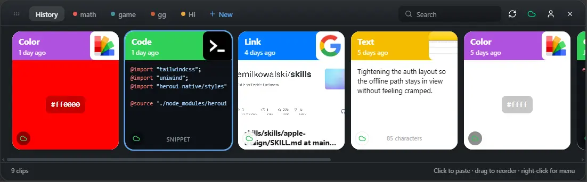
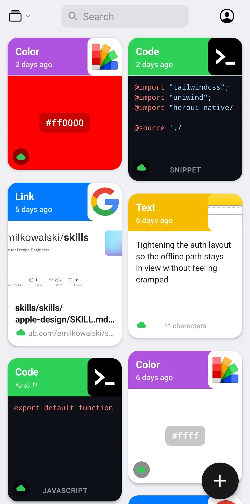

<p align="center">
  
</p>

<p align="center">
  <strong>Zero-knowledge clipboard history</strong> for Windows, Linux &amp; Android.<br/>
  Everything you copy stays yours — encrypted on-device, synced as ciphertext only.
</p>

<p align="center">
  <a href="https://github.com/alishirani1384/ZeroPaste/releases/download/desktop-v1.0.5/ZeroPaste-desktop-v1.0.5-Setup.zip"></a>
  &nbsp;
  <a href="https://github.com/alishirani1384/ZeroPaste/releases/download/desktop-v1.0.5/ZeroPaste-desktop-v1.0.5-linux-x64-Setup.tar.gz"></a>
  &nbsp;
  <a href="https://github.com/alishirani1384/ZeroPaste/releases/download/android-v2.0.1/ZeroPaste-android-v2.0.1.apk"></a>
</p>

<p align="center">
  <a href="https://github.com/alishirani1384/ZeroPaste/releases"></a>
  <a href="LICENSE"></a>
  <a href="SECURITY.md"></a>
  <a href="https://github.com/alishirani1384/ZeroPaste"></a>
</p>

---

<p align="center">
  
</p>

<p align="center">
  <em>Desktop shelf — typed clips, pinboards, local search, encrypted cloud sync</em>
</p>

<p align="center">
  
</p>

<p align="center">
  <em>Android — the same vault model, offline-first history, pull-to-refresh sync</em>
</p>

---

## Why ZeroPaste

Most clipboard managers treat your history as convenient junk drawer data. ZeroPaste treats every clip as **sensitive by default**.

| Promise | What it means in practice |
|--------|---------------------------|
| **Your passphrase never leaves the device** | Account login ≠ vault key. Supabase Auth only identifies you for sync ACLs. |
| **Server never sees plaintext** | Bodies, titles, URLs, previews, images — ciphertext only. |
| **Open crypto, not marketing** | Argon2id + AES-256-GCM, client-side envelopes, recovery key at vault creation. |
| **Works offline** | Local vault + history without an account. Sync is optional. |
| **Cross-platform one vault** | Desktop + Android share the same encrypted cloud vault when you choose to sync. |

If someone steals the database, intercepts the network, or works at the sync provider — **they still cannot read your clips**. Losing both your passphrase *and* recovery key means even *you* cannot decrypt cloud ciphertext. That is intentional.

---

## Download

| Platform | Package | Link |
|----------|---------|------|
| **Windows** 10/11 | Installer zip → run **`Install ZeroPaste.exe`** | [ZeroPaste-desktop-v1.0.5-Setup.zip](https://github.com/alishirani1384/ZeroPaste/releases/download/desktop-v1.0.5/ZeroPaste-desktop-v1.0.5-Setup.zip) |
| **Linux** x64 (Ubuntu 22.04+) | Installer archive → run **`./installer`** | [ZeroPaste-desktop-v1.0.5-linux-x64-Setup.tar.gz](https://github.com/alishirani1384/ZeroPaste/releases/download/desktop-v1.0.5/ZeroPaste-desktop-v1.0.5-linux-x64-Setup.tar.gz) |
| **Android** | Sideload APK | [ZeroPaste-android-v2.0.1.apk](https://github.com/alishirani1384/ZeroPaste/releases/download/android-v2.0.1/ZeroPaste-android-v2.0.1.apk) |

All builds: **[github.com/alishirani1384/ZeroPaste/releases](https://github.com/alishirani1384/ZeroPaste/releases)**

<details>
<summary><strong>Windows install tip</strong></summary>

Unzip the release and double-click **`Install ZeroPaste.exe`** (not Setup alone). That wrapper extracts Electrobun’s payload and launches the app. Keep `Install ZeroPaste.exe`, `ZeroPaste-Setup.exe`, and the installer payload together.

</details>

<details>
<summary><strong>Linux install tip</strong></summary>

```bash
tar -xzf ZeroPaste-desktop-v1.0.5-linux-x64-Setup.tar.gz
./installer
```

The Electrobun installer extracts to `~/.local/share/` and creates a desktop shortcut. Needs GTK3 + WebKitGTK 4.1 (standard on Ubuntu 22.04+). For paste injection tools on X11/Wayland, see [LINUX.md](./apps/desktop/LINUX.md).

</details>

<details>
<summary><strong>Android install tip</strong></summary>

Enable install from unknown sources for your browser/file manager, then open the APK. Background clipboard watching may show a sticky notification (Account → Stay ready in background).

</details>

---

## Security model (read this)

ZeroPaste assumes **Supabase, Postgres, Realtime, Storage, and the network are untrusted for content confidentiality**. An attacker with full database access must not recover clip plaintext.

### Cryptographic pipeline

```text
passphrase (or recovery key)
        │
        ▼
   Argon2id  (t=3, m=128 MiB for new vaults, p=1)
        │
        ▼
    vault_key  (32 bytes)  ── never uploaded
        │
        ├── wraps per-clip content keys (AES-GCM key wrap)
        │
        └── each clip/image: random content key → AES-256-GCM envelope
```

| Layer | Detail |
|-------|--------|
| **KDF** | Argon2id — memory-hard; new vaults use **128 MiB** (`m=131072`). Legacy vaults keep their stored KDF params so unlock stays compatible. |
| **Content encryption** | Per-item random key + **AES-256-GCM**. Images/files are encrypted **before** Storage upload. |
| **Account vs vault** | Email/password only gates sync identity (RLS). It cannot decrypt your vault. |
| **Unlock session** | Optional 7-day local unlock (device-secret wrapped). Passphrase asked again after expiry, lock, or sign-out. |
| **Recovery** | One-time recovery key at vault creation. Store it offline. |
| **Desktop at rest** | `~/.zeropaste` sealed (Windows DPAPI for host key + AES-GCM payloads; Linux mode-0600 host key). |
| **Android at rest** | Unlock material in **SecureStore / Keystore**. |
| **Local bridge** | Desktop WebView ↔ host uses a **per-install token**; CORS is origin-locked (no `*`). |

### What the server *can* see

Only minimal sync routing metadata: ids, timestamps, optional coarse kind, byte size, storage path.

### What the server *cannot* see

Clip bodies, titles, source apps, URLs, link previews, image pixels, pinboard names — **ciphertext**.

Full write-up: **[SECURITY.md](./SECURITY.md)**.

---

## Features

### Clipboard intelligence
- Automatic capture of text, code, links, colors, and images
- Typed cards with previews (syntax highlighting, color swatches, rich link cards)
- Local full-text search over your decrypted cache — **no server-side plaintext index**
- Soft-delete with encrypted tombstones so deletes sync across devices

### Organization
- Pinboards / shelves (History + custom boards)
- Drag-to-reorder, click-to-paste, context menus
- Desktop hotkey: **Ctrl+Shift+V**

### Sync (optional)
- End-to-end encrypted pull / push over Supabase
- Realtime updates when signed in
- Incremental cloud pull + progressive decrypt
- Offline-first: continue without an account

### Desktop polish
- Electrobun host (Windows + Linux x64 releases)
- Autostart, tray, focus-safe paste injection
- Crash-safe sealed session restore across reboots

### Android polish
- Expo / React Native native build
- Pull-to-refresh cloud sync
- Background readiness notification (optional)

---

## Architecture

| App | Path | Stack |
|-----|------|--------|
| **Desktop** | `apps/desktop` | Electrobun (Bun host + WebView) |
| **Web UI** | `apps/web` | Next.js panel embedded in desktop |
| **Android** | `apps/native` | Expo / React Native |

| Package | Role |
|---------|------|
| `@paste/clipboard-core` | Clip model, classifier, search |
| `@paste/crypto` | Argon2id + AES-GCM envelopes |
| `@paste/sync` | Encrypted clip/pinboard sync, vault meta |
| `@paste/ui` / `@paste/env` / `@paste/config` | Shared UI, env, tooling |

```text
┌─────────────────┐     sealed localhost bridge      ┌──────────────────┐
│  Next.js shelf  │ ◄──────────────────────────────► │ Electrobun host  │
│  (vault UI)     │     token + origin lock          │ clipboard / FS   │
└────────┬────────┘                                  └──────────────────┘
         │ ciphertext only (optional)
         ▼
   Supabase Auth + RLS + Storage
```

---

## Quick start (developers)

```bash
bun install
bun run dev:web        # Landing → http://localhost:3001 · shelf → /app
bun run dev:desktop    # Electrobun loads /app + HMR (bridge on :47821)
bun run dev:native     # Expo Metro
bun run prebuild:native && bun run android:native
```

| Topic | Doc |
|-------|-----|
| Android | [apps/native/README.md](./apps/native/README.md) |
| Linux paste tools / deps | [apps/desktop/LINUX.md](./apps/desktop/LINUX.md) |
| Windows packaging | [apps/desktop/PACKAGING.md](./apps/desktop/PACKAGING.md) |
| Security | [SECURITY.md](./SECURITY.md) |

### Desktop journey

1. **Account** — sign in / sign up, or Continue offline  
2. **Vault** — create, unlock, or restore wraps from cloud then unlock  
3. **Shelf** — history in `~/.zeropaste/`; encrypted sync when signed in  

Lock from the toolbar. Account & sync: cloud icon or `/account`.

### Supabase (self-host / own project)

1. Create a project and run **all** `supabase/migrations/*.sql` (includes `vault_meta`)  
2. Copy `apps/web/.env.example` → `apps/web/.env` (URL + anon key)  
3. Sign in during onboarding — vault wraps + clips sync as **ciphertext only**

---

## Threat checklist (assurance)

- [x] Sync provider cannot decrypt clip content  
- [x] Network observers see only opaque envelopes  
- [x] Auth password ≠ vault passphrase  
- [x] Images encrypted before object storage  
- [x] Search stays on-device  
- [x] Desktop session sealed at rest; Android unlock in Keystore  
- [x] Bridge not a wild-open localhost API  
- [x] Open source — audit the crypto in `@paste/crypto` and sync path yourself  

---

## Contributing & releases

CI publishes versioned GitHub Releases when `apps/desktop` / `apps/native` versions bump on `main` (see `.github/workflows/release.yml`).

Issues and PRs welcome. If you find a crypto or trust-boundary bug, please open a private security report or an issue labeled `security` — prefer responsible disclosure for exploitable flaws.

---

<p align="center">
  <br/>
  <strong>ZeroPaste</strong> — your clipboard, zero plaintext in the cloud.
</p>
